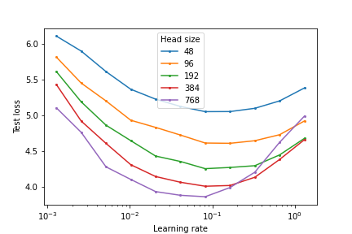

Getting MuP to work on NanoGPT codebase with minimal changes

Use `python est_mup_nano_gpt.py` to perform the coordinate check and generate the base shape file (following mup)

Call `bash run.sh` to run some experiments, some quick runs for 5000 iterations give you

TODO:
- Figure out what exactly changes I made
- Get some results 

